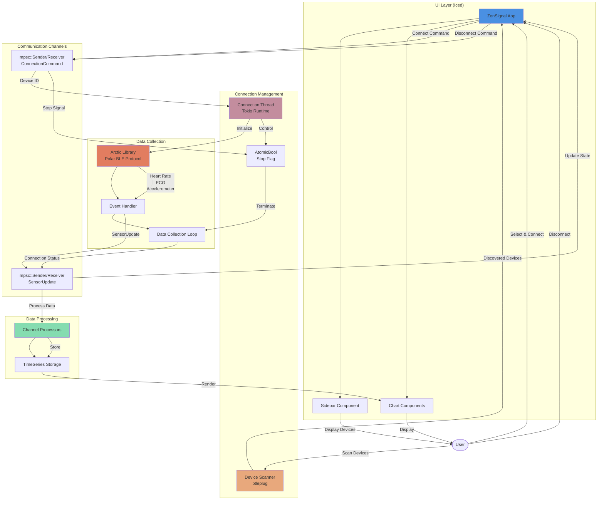

# ZenSignal Architecture

## Component Descriptions

### UI Layer
- **ZenSignal App**: Main application state and message handler
- **Sidebar**: Device list, scan button, connect/disconnect controls
- **Charts**: Real-time visualization using plotters-iced (ECG, HR, RR, Accelerometer)

### Connection Management
- **Device Scanner**: Uses btleplug to discover nearby Polar devices
- **Connection Thread**: Manages async Polar sensor connections via Tokio runtime
- **Stop Flag**: Thread-safe atomic flag for graceful disconnection

### Data Collection
- **Arctic Library**: Handles Polar H10 Bluetooth protocol communication
- **Event Handler**: Receives sensor events and forwards to UI
- **Data Collection Loop**: Runs event loop with cancellation support via tokio::select!

### Data Processing
- **Channel Processors**: Separate processors for each data type (HR, RR, ECG, ACC)
- **TimeSeries Storage**: Efficient storage for streaming data points

### Communication
- **Update Channel**: Sends sensor data and connection status from backend to UI
- **Command Channel**: Sends connect/disconnect commands from UI to backend

## Data Flow

1. **Discovery**: User scans → btleplug discovers devices → UI displays list
2. **Connection**: User selects device → Command sent → Arctic connects → Status feedback
3. **Streaming**: Arctic receives data → Handler processes → Channels update → Charts render
4. **Disconnection**: User clicks disconnect → Stop flag set → Loop exits → State reset

## Thread Model

- **Main Thread**: Iced UI rendering and event handling (16ms tick rate)
- **Connection Thread**: Manages Polar device lifecycle and async operations
- **Data Thread**: Implicit in Arctic's event loop for BLE communication

## Key Design Decisions

- **Channel-based Communication**: Decouples UI from backend for responsiveness
- **Atomic Stop Flag**: Enables clean shutdown without blocking
- **tokio::sync::RwLock**: Allows Send-safe sharing across async tasks
- **Message Processing Loop**: Drains entire queue each tick to prevent lag
