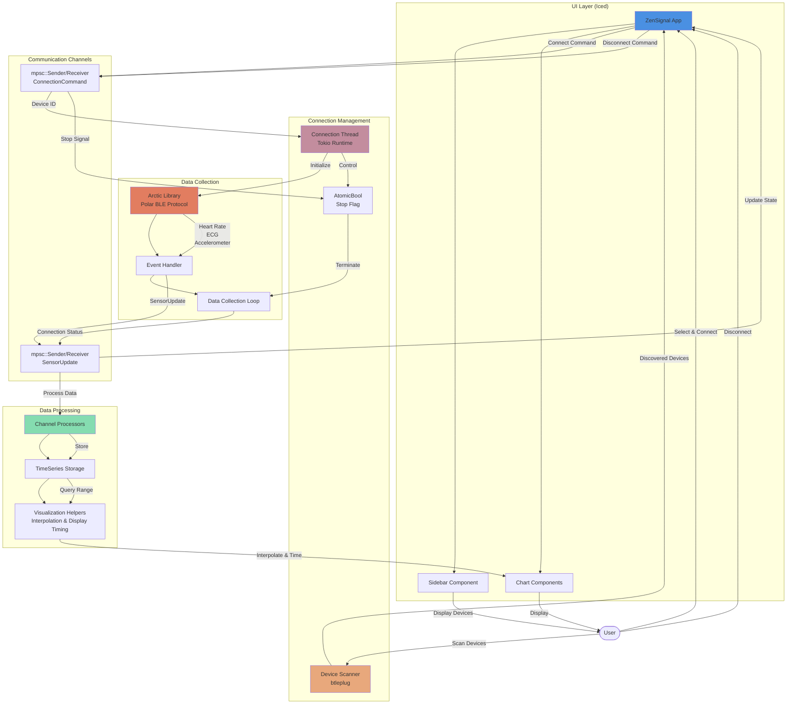

# ZenSignal Architecture



## Detailed Sequences

### Connection Sequence

1. **User Action**: User clicks "Scan for Devices" button
2. **Device Discovery**: btleplug scans for 5 seconds, filters Polar devices
3. **Device Display**: Discovered devices shown in sidebar with selection highlight
4. **User Selection**: User selects device and clicks "Connect"
5. **Command Sent**: UI sends `ConnectionCommand::Connect(device_id)` via mpsc channel
6. **Connection Thread**: Receives command and spawns async task in Tokio runtime
7. **Sensor Initialization**: `PolarSensor::new(device_id)` creates connection
8. **Connection Loop**: Attempts connection with stop flag checks between retries
9. **Status Updates**: Sends `ConnectionStatus` updates throughout process
10. **Stream Subscription**: Subscribes to HeartRate and MeasurementData streams
11. **Sample Rate Config**: Queries device settings and sets to maximum rates
12. **Event Loop Start**: Begins listening for sensor data with tokio::select!
13. **Data Flow**: Arctic → Handler → mpsc → UI → Channels → Charts

### Disconnect Sequence

1. **User Action**: User clicks "Disconnect" button
2. **Manual Flag**: Sets `manual_disconnect = true` to prevent auto-reconnect
3. **Command Sent**: UI sends `ConnectionCommand::Disconnect`
4. **Stop Flag Set**: Connection thread sets AtomicBool to true
5. **Loop Exit**: Event loop detects stop flag in tokio::select! branch
6. **Cleanup**: Sends `ConnectionStatus::Disconnected` to UI
7. **State Reset**: UI clears data channels and updates connection state

### Data Processing Pipeline

1. **Sensor Data Arrival**: Polar H10 sends batch of samples (no timestamps)
2. **Handler Receipt**: EventHandler receives HeartRate or PmdRead
3. **Channel Send**: Handler forwards via mpsc to UI thread
4. **Tick Processing**: UI's 16ms subscription processes all pending messages
5. **Timestamp Calculation**: Derives individual timestamps using sample rate
   - Continuous: Extends from last known timestamp + interval
   - First batch: Spreads backwards from current time
6. **Channel Routing**: Distributes samples to appropriate TimeSeries (ECG, ACC, etc.)
7. **Storage**: Points added to Vec with calculated timestamps
8. **Interpolation** (for HR/RR/HRV only):
   - Forward-fills gaps for continuous visualization
   - Adds synthetic points at display window boundaries
9. **Chart Rendering**: plotters-iced draws series from time ranges

### Smooth Streaming Mechanism

**Problem**: Low-rate streams (HR, RR at ~1Hz) create visible gaps at chart edge
- Data arrives sporadically
- If we render "now", edge shows no data yet

**Solution**: Display with 1.5s delay (implemented in `visualization` module)
```rust
// visualization.rs
const DISPLAY_DELAY_NS: u64 = 1_500_000_000; // 1.5 seconds

pub fn current_display_time(smooth_streaming: bool) -> u64 {
    let now = SystemTime::now().as_nanos();
    if smooth_streaming {
        now - DISPLAY_DELAY_NS  // Show data from 1.5s ago
    } else {
        now  // Show latest data immediately
    }
}
```

**Why 1.5 seconds?**
- HR updates arrive every ~1 second
- Guarantees data has arrived before we try to display it
- Trade-off: Slight delay vs. smooth continuous visualization

### HRV (RMSSD) Calculation

1. **RR Intervals Collected**: Each heartbeat interval stored with timestamp
2. **Rolling Window**: Use last 30 seconds of RR data
3. **RMSSD Formula**: Root Mean Square of Successive Differences
   ```
   differences = [RR[i+1] - RR[i] for each pair]
   squared = [d² for d in differences]
   mean = sum(squared) / len(squared)
   rmssd = sqrt(mean)
   ```
4. **Update Frequency**: Recalculated on each new HR update
5. **Storage**: Stored as separate TimeSeries for charting

## Implementation Details

### Timestamp Derivation

Polar H10 sends batches of samples without individual timestamps. We derive them:

```rust
fn calculate_start_time(
    last_point: Option<u64>,
    now: u64,
    count: u64,
    timestep: u64,
) -> u64 {
    if let Some(last) = last_point {
        // Continuous: extend from last + interval
        last + timestep
    } else if count > 0 {
        // First batch: spread backwards from now
        now - ((count - 1) * timestep)
    } else {
        now
    }
}
```

**Why spread backwards?**
- Avoids creating timestamps in the future
- Ensures realistic time axis behavior
- Maintains temporal coherence with other streams

### Interpolation Strategy

Only applied to low-rate streams (HR, RR, HRV):

1. **Boundary Points**: Always add points at window edges (start_time, end_time)
   - Prevents sudden line starts/stops
   - Creates smooth scrolling effect
   
2. **Between Points**: Add intermediate points every 100ms
   - Linear interpolation between actual data points
   - Smooth curves without over-fitting
   
3. **Extrapolation**: Limited to 3x normal interval
   - Prevents wild predictions when data stops
   - Graceful degradation on connection loss

### Logging Levels

- **ERROR**: Connection failures, send failures, adapter issues
- **WARN**: Connection retry attempts
- **INFO**: Connection lifecycle, sample rate changes, disconnect
- **DEBUG**: Connection attempts, stop flag operations, HR data

### Module Organization

```
src/
├── main.rs           # Entry point, app initialization
├── app.rs            # UI state, message handling, view composition  
├── connection.rs     # Connection management thread
├── sensor.rs         # Arctic integration, event handling
├── polar_data.rs     # Polar-specific data processing and channels
├── timeseries.rs     # Generic time series storage
├── visualization.rs  # Display timing, interpolation helpers
├── charts.rs         # Plotters chart definitions
├── config.rs         # Settings persistence
├── device_scanner.rs # Bluetooth device discovery
├── error.rs          # Error types and handling
└── ui/
    ├── mod.rs        # UI module root
    └── styles.rs     # Button and widget styling
```

**Future Expansion Planned**:
```
src/
└── ui/
    ├── live_view.rs   # Current real-time visualization
    ├── config_view.rs # Settings panel
    └── viewer.rs      # Recording playback with annotations
```

## Testing Strategy

### Current Coverage
- **Unit Tests**: TimeSeries operations, config serialization
- **Integration Tests**: Connection manager creation

### Future Tests Needed
- Interpolation edge cases
- Timestamp calculation with gaps
- RMSSD calculation accuracy
- Connection retry logic
- Stop flag propagation
- Mock sensor data processing

## Performance Considerations

### Memory Management
- TimeSeries uses `Vec<Point>` - grows unbounded currently
- **Future**: Implement circular buffer with max duration
- **Target**: Keep last 10 minutes, ~130KB for ECG at 130Hz

### Rendering Optimization
- Charts rebuild on every 16ms tick
- **Current**: O(n) where n = points in time window
- **Opportunity**: Cache interpolated points between frames

### Channel Throughput
- ECG: 130 samples/sec = ~2KB/sec
- ACC: 200 samples/sec × 3 axes = ~2.4KB/sec  
- HR/RR: ~1 sample/sec = negligible
- **Total**: ~5KB/sec sustained data rate

## Error Handling

### Current Approach
- Errors logged via `log` crate
- Connection errors sent to UI via `ConnectionStatus::Error`
- Silent fallback for config load failures

### Future Improvements
- Custom error types per module
- Error recovery strategies (auto-retry with backoff)
- User-visible error notifications in UI
- Error metrics and diagnostics panel

## Component Descriptions

### UI Layer
- **ZenSignal App**: Main application state and message handler
- **Sidebar**: Device list, scan button, connect/disconnect controls, settings checkboxes
- **Charts**: Real-time visualization using plotters-iced (ECG, HR, RR, HRV, Accelerometer)
- **UI Styles Module**: Centralized styling for consistent button appearance

### Connection Management
- **ConnectionManager**: Encapsulates connection thread and command processing
- **Device Scanner**: Uses btleplug to discover nearby Polar devices
- **Connection Thread**: Manages async Polar sensor connections via Tokio runtime
- **Stop Flag**: Thread-safe atomic flag for graceful disconnection

### Data Collection
- **Arctic Library**: Handles Polar H10 Bluetooth protocol communication
- **Event Handler**: Receives sensor events and forwards to UI via channels
- **Data Collection Loop**: Runs event loop with cancellation support via tokio::select!
- **Sample Rate Configuration**: Queries device and sets to maximum supported rates

### Data Processing
- **Channel Processors**: Separate processors for each data type (HR, RR, ECG, ACC, HRV)
- **TimeSeries Storage**: Efficient storage for streaming data points
- **Interpolation Engine**: Smooths low-rate data for continuous visualization
- **Timestamp Calculator**: Derives individual sample timestamps from batched data

### Communication
- **Update Channel**: Sends sensor data and connection status from backend to UI
- **Command Channel**: Sends connect/disconnect commands from UI to backend

### Configuration System
- **Config**: Persistent settings stored in TOML format
  - `enable_autoconnect`: Automatically connect to first Polar device
  - `smooth_data_streaming`: Enable 1.5s display delay for smoother charts
- **Storage**: Platform-specific config directories (XDG on Linux, Application Support on macOS)

## Data Flow

1. **Discovery**: User scans → btleplug discovers devices → UI displays list
2. **Connection**: User selects device → Command sent → Arctic connects → Status feedback
3. **Streaming**: Arctic receives data → Handler processes → Channels update → Charts render
4. **Disconnection**: User clicks disconnect → Stop flag set → Loop exits → State reset

## Thread Model

- **Main Thread**: Iced UI rendering and event handling (16ms tick rate)
- **Connection Thread**: Manages Polar device lifecycle and async operations
- **Data Thread**: Implicit in Arctic's event loop for BLE communication

## Key Design Decisions

- **Channel-based Communication**: Decouples UI from backend for responsiveness
- **Atomic Stop Flag**: Enables clean shutdown without blocking
- **tokio::sync::RwLock**: Allows Send-safe sharing across async tasks
- **Message Processing Loop**: Drains entire queue each tick to prevent lag
